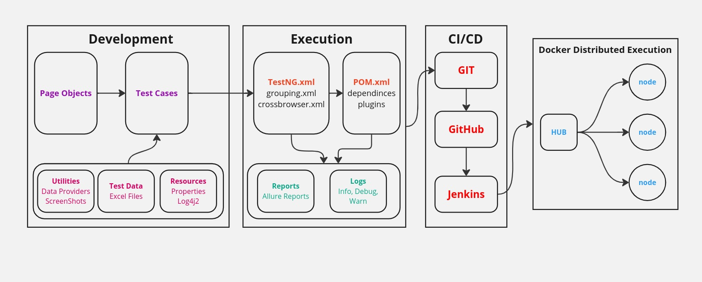

# 🚀 Dockerized NopCommerce E2E Testing
<h3><i>
This project is designed to execute end-to-end automation test cases
for NopCommerce using a distributed model with Docker and Selenium Grid.
</i></h3>

---

## Framework Design


---

## 🛠️ Technologies
<h4>

<ul>
<li>Selenium WebDriver: For browser automation.</li>
<li>TestNG: For organizing and running test cases.
</li>
<li>Selenium Grid: For distributed test execution.
</li>
<li>Docker: To containerize the Selenium Grid and manage distributed nodes.
</li>
<li>Allure Reports: For generating detailed test reports with screenshots.
</li>
<li>Log4j2: For logging test execution details.
</li>
</ul>
</h4>

---

## 🌟 Features
<h4>
<ul>
<li>Page Object Model: Implements the POM  DP for maintainable and scalable test code.</li>
<li>Remote and Local Execution: Supports running tests both locally and on a remote Selenium Grid.</li>
<li>Data-Driven Testing: Allows tests to be run with multiple sets of data.</li>
<li>Cross-Browser Testing: Tests can be executed across different browsers.</li>
<li>Test Case Grouping: Organize and group test cases for efficient execution.</li>
<li>Screenshots on Failure: Automatically captures screenshots when a test fails.
</li>
</ul>
</h4>

---

## 🚀 How to Run
1. Clone the repo
2. Download Docker and Docker Compose
3. Navigate to the project repo and run the following to create docker network
```
docker-compose up
```
4. Open "localhost:80" on your browser and setup NopCommerce website
5. To Run testcases we have multiple options
   1. Maven surefire plugin
   2. TestNG.xml file
---

## 📊  Reports and Logs
1. After executing testcases, run ```allure serve``` to open report
2. After executing testcases, all logs will be found in logs dir :)
